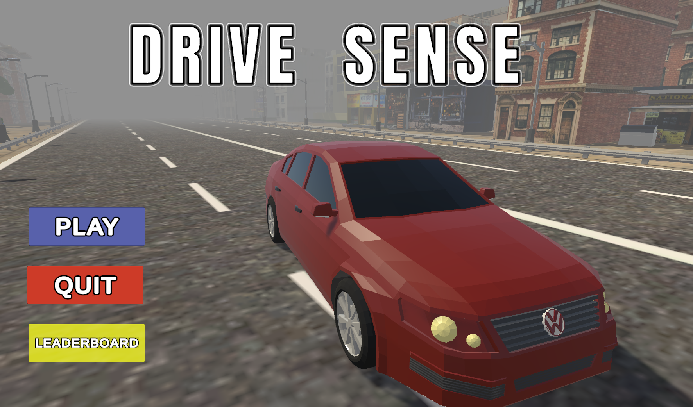
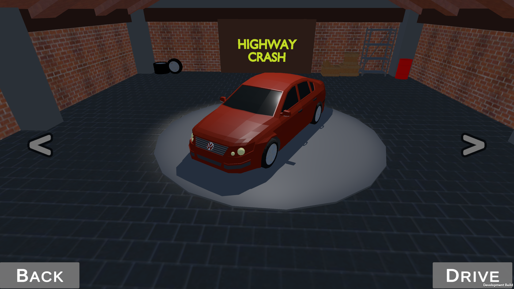
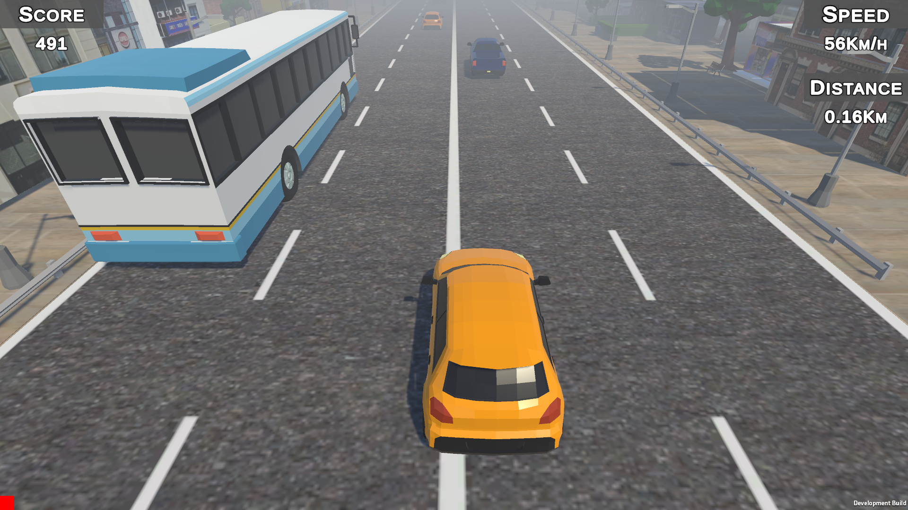
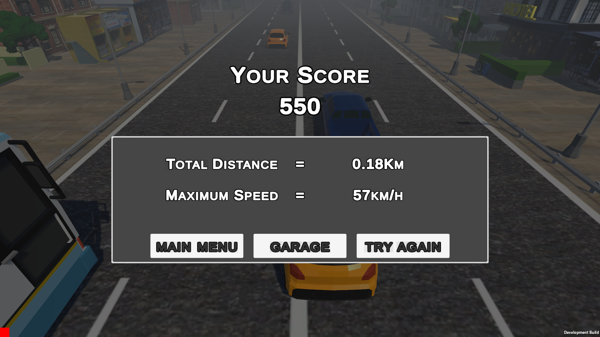

# DriveSense 🚗🎮

[](https://unity.com/)
[](https://www.python.org/)
[](https://mediapipe.dev/)
[](https://opencv.org/)
[](LICENSE)

> **AI-Powered Gesture-Controlled Driving Simulation**  
> Control a virtual car using hand gestures instead of traditional input devices

**Developed for DEVJAM 14-01-2026** by [Nayan Mishra](https://github.com/Nayan993) and [Anuj Sahu](https://github.com/anujsahu8847-hash)

---

## 🎮 Play Now

[]([YOUR_ITCH_IO_LINK_HERE](https://nayanmishra.itch.io/drivesense-gesture-driving))

---

## 📖 Table of Contents

- [Abstract](#-abstract)
- [Screenshots](#-screenshots)
- [Introduction](#-introduction)
- [Objectives](#-objectives)
- [System Architecture](#-system-architecture)
- [Technologies Used](#-technologies-used)
- [Functional Modules](#-functional-modules)
- [Working Principle](#-working-principle)
- [Installation](#-installation)
- [Usage](#-usage)
- [Implementation Details](#-implementation-details)
- [Advantages](#-advantages)
- [Applications](#-applications)
- [Limitations](#-limitations)
- [Future Enhancements](#-future-enhancements)
- [Project Structure](#-project-structure)
- [Team](#-team)
- [Contributing](#-contributing)
- [License](#-license)
- [References](#-references)

---

## 📄 Abstract

**DriveSense** is an innovative driving simulation system that allows users to control a virtual car using **hand gestures** instead of traditional input devices such as keyboards or game controllers. The project integrates computer vision, Python-based gesture recognition, and Unity game engine physics to create an immersive and intuitive driving experience. 

The system interprets real-time hand movements captured through a camera and converts them into driving commands like **acceleration**, **braking**, and **steering**. This project demonstrates the seamless integration of artificial intelligence, computer vision, and game development to create a natural and engaging human-computer interaction experience.

### Key Innovation
Traditional driving simulators require physical controllers, limiting accessibility and natural interaction. DriveSense eliminates this barrier by enabling **contactless, gesture-based control**, making driving simulations more interactive, realistic, and accessible to a wider audience.

---

## 📸 Screenshots

### Main Menu Interface

*Sleek main menu with gesture control initialization*

### Garage Selection System

*Interactive car selection with 3D preview and vehicle stats*

### Gameplay with Real-Time Tracking

*Gesture-controlled racing with live hand tracking overlay*

### Game Statistics Display

*Performance statistics and replay options*

---

## 🎯 Introduction

Traditional driving simulators rely heavily on keyboards, joysticks, or steering wheels. While effective, these methods lack **natural interaction** and require dedicated hardware. DriveSense aims to bridge this gap by introducing **gesture-based control**, making driving simulations more interactive, realistic, and accessible.

### Problem Statement
Current driving simulation systems face several challenges:
- **Hardware Dependency**: Require expensive steering wheels or controllers
- **Limited Accessibility**: Not intuitive for first-time users
- **Lack of Immersion**: Physical controllers break the sense of presence
- **Setup Complexity**: Additional hardware installation and calibration

### Our Solution
DriveSense addresses these challenges through:
- **Contactless Control**: Uses only a standard webcam
- **Natural Gestures**: Intuitive hand movements anyone can perform
- **Real-Time Processing**: Low-latency response (<50ms)
- **AI-Powered Recognition**: MediaPipe machine learning for accurate tracking

This project demonstrates the integration of **Python**, **machine vision**, and **Unity 3D** to showcase how modern human-computer interaction techniques can enhance simulation systems.

---

## 🎯 Objectives

The primary objectives of DriveSense are:

### Core Goals

✅ **Control a car in Unity using hand gestures**  
Replace traditional keyboard/controller inputs with natural hand movements detected through computer vision.

✅ **Replace keyboard input with gesture-based commands**  
Eliminate the need for physical input devices, making the simulation accessible to anyone with a webcam.

✅ **Integrate Python gesture recognition with Unity C# scripts**  
Establish seamless communication between the Python-based AI backend and Unity game engine through socket-based architecture.

✅ **Create a smooth, realistic driving experience using Wheel Colliders**  
Implement physics-based vehicle dynamics that respond naturally to gesture inputs with realistic acceleration, braking, and steering.

✅ **Improve immersion and reduce hardware dependency**  
Enable a more natural and immersive driving experience without requiring specialized gaming hardware.

### Technical Objectives
- Achieve **30+ FPS** gesture recognition processing
- Maintain **<50ms** input latency from gesture to car response
- Support **multiple vehicle types** with different handling characteristics
- Implement **robust error handling** for camera disconnections
- Provide **visual feedback** for gesture recognition status

---

## 🏗 System Architecture

### Architecture Overview

The DriveSense system consists of five interconnected components that work together to enable gesture-controlled driving:

```
┌─────────────────────────────────────────────────────────────────────┐
│                         DRIVESENSE SYSTEM                           │
└─────────────────────────────────────────────────────────────────────┘

┌──────────────────┐         ┌──────────────────┐         ┌──────────────────┐
│  1. Camera Input │────────▶│  2. Python ML    │────────▶│  4. Unity Game   │
│                  │         │     Backend      │         │     Engine       │
│  - Webcam Feed   │         │                  │         │                  │
│  - 640x480 @ 30  │         │  - MediaPipe     │         │  - Receives      │
│  - Real-time     │         │  - Hand Tracking │         │    Commands      │
│    Capture       │         │  - Gesture Class │         │  - Controls Car  │
└──────────────────┘         └──────────────────┘         │    Physics       │
                                      │                    └──────────────────┘
                                      │
                             ┌────────▼────────┐
                             │  3. Comm Layer  │
                             │                 │
                             │  - Socket.IO    │
                             │  - JSON Data    │
                             │  - Port 5000    │
                             └─────────────────┘
                                      │
                             ┌────────▼────────┐
                             │  5. Car Control │
                             │                 │
                             │  - Motor Torque │
                             │  - Brake Torque │
                             │  - Steering     │
                             └─────────────────┘
```

### Component Breakdown

#### 1. **Camera Input**
**Purpose**: Captures real-time hand movements from the user

**Functionality**:
- Continuously captures video feed from webcam at 30 frames per second
- Provides 640x480 resolution for optimal balance between quality and performance
- Feeds raw video frames to the Python gesture recognition module

#### 2. **Python Gesture Recognition Module**
**Purpose**: Uses computer vision to detect and classify hand gestures

**Key Functions**:
- **Hand Detection**: Identifies hands in the video frame using MediaPipe's machine learning models
- **Landmark Extraction**: Detects 21 key points on each hand (knuckles, fingertips, wrist)
- **Gesture Classification**: Analyzes hand pose and orientation to determine the intended command
- **Processes Gestures**:
  - Open palm → Accelerate
  - Closed fist → Brake/Stop
  - Hand tilted left → Turn left
  - Hand tilted right → Turn right

#### 3. **Communication Layer**
**Purpose**: Transfers gesture commands from Python to Unity

**Methods**:
- **Socket Communication**: Real-time bidirectional communication using Socket.IO
- **JSON Serialization**: Converts gesture data into structured format
- **Port Configuration**: Uses localhost port 5000 for local communication
- **Alternative Methods**: Supports keyboard simulation and direct input mapping

#### 4. **Unity Game Engine**
**Purpose**: Receives commands and manages the game simulation

**Responsibilities**:
- Receives gesture commands from Python backend
- Updates car physics based on input
- Manages game state (menu, garage, gameplay, game over)
- Renders 3D graphics and user interface
- Handles collision detection and game logic

#### 5. **Car Controller System**
**Purpose**: Applies realistic vehicle physics and movement

**Controls**:
- **Motor Torque**: Controls acceleration force applied to drive wheels
- **Brake Torque**: Controls braking force applied to all wheels
- **Steering Angle**: Controls front wheel steering angle (±35 degrees)
- **Physics Simulation**: Uses Unity's Wheel Collider system for realistic tire behavior

### Data Flow Diagram

```
User Hand Gesture
        ↓
Webcam Captures Video Frame
        ↓
Python Receives Frame (OpenCV)
        ↓
MediaPipe Processes Frame
        ↓
Hand Landmarks Detected (21 points)
        ↓
Gesture Classification Algorithm
        ↓
Gesture Identified (e.g., "accelerate")
        ↓
JSON Data Created
        ↓
Socket Transmission to Unity
        ↓
Unity Receives JSON Command
        ↓
Input Manager Parses Data
        ↓
Car Controller Updates Physics
        ↓
Wheel Colliders Apply Forces
        ↓
Car Movement Rendered on Screen
        ↓
UI Updates (Speed, Distance, Gesture Feedback)
```

---

## 🛠 Technologies Used

### Software Technologies

| Technology | Purpose | Version |
|------------|---------|---------|
| **Unity Engine** | 3D game development and physics simulation | 2021.3 LTS+ |
| **C#** | Game logic, scripting, and Unity integration | .NET Framework |
| **Python** | AI/ML backend for gesture recognition | 3.9+ |
| **OpenCV** | Computer vision and video frame processing | 4.8.1+ |
| **MediaPipe** | Hand tracking and landmark detection ML model | 0.10.8+ |
| **Socket.IO** | Real-time bidirectional communication | 5.10.0+ |
| **NumPy** | Mathematical operations and array handling | 1.24.3+ |
| **Git & GitHub** | Version control and collaboration | Latest |

### Unity Packages

- **TextMeshPro** - High-quality UI text rendering and typography
- **Cinemachine** - Advanced camera control and smooth following
- **Unity Physics** - Wheel Collider physics simulation
- **Post-Processing Stack** - Visual effects and graphics enhancement

### Python Libraries

Essential dependencies for the gesture recognition backend:
- **mediapipe** - Pre-trained hand tracking machine learning model
- **opencv-python** - Video capture and image processing
- **numpy** - Numerical computations and array operations
- **python-socketio** - WebSocket communication protocol
- **flask** - Lightweight web framework for server
- **flask-socketio** - Flask integration with Socket.IO

### Hardware Requirements

| Component | Minimum | Recommended |
|-----------|---------|-------------|
| **Operating System** | Windows 10, macOS 10.15, Ubuntu 20.04 | Windows 11, macOS 12+, Ubuntu 22.04 |
| **Processor** | Intel i5 / AMD Ryzen 5 | Intel i7 / AMD Ryzen 7 |
| **RAM** | 8 GB | 16 GB |
| **Graphics** | Intel HD 4000 / AMD Radeon | NVIDIA GTX 1050 / AMD RX 560 |
| **Storage** | 2 GB free space | 5 GB SSD |
| **Webcam** | 480p @ 15 FPS | 720p @ 30 FPS |

---

## 🔧 Functional Modules

### 6.1 Hand Gesture Recognition Module

**Purpose**: Detects and classifies hand gestures in real-time using computer vision

**Functionality**:
- **Hand Landmark Detection**: Uses MediaPipe to identify 21 key points on the hand including fingertips, knuckles, and wrist
- **Multi-hand Support**: Capable of tracking multiple hands but uses the dominant hand for control
- **Gesture Classification**: Analyzes hand pose, finger positions, and orientation to determine the intended command
- **Confidence Scoring**: Provides reliability metrics for each gesture detection to filter out uncertain readings

**Supported Gestures**:

| Gesture | Action | Description | Use Case |
|---------|--------|-------------|----------|
| **Open Palm** | Accelerate | All fingers extended, palm facing camera | Move forward |
| **Closed Fist** | Brake/Stop | All fingers curled into palm | Slow down or stop |
| **Index Finger** | Turn Left | Hand rotated 20-45° to the left | Steer left |
| **Pinky Finger** | Turn Right | Hand rotated 20-45° to the right | Steer right |
| **Two finger** | Coast | Hand centered, relaxed position | Maintain current speed |

### 6.2 Gesture-to-Control Mapping

**Purpose**: Translates recognized gestures into Unity-compatible driving commands

**Process Flow**:
1. **Gesture Recognition**: Python identifies the current hand gesture
2. **Command Generation**: Maps gesture to specific control values (motor torque, brake torque, steering angle)
3. **Data Serialization**: Converts control data into JSON format for transmission
4. **Socket Transmission**: Sends data to Unity via Socket.IO
5. **Unity Parsing**: Receives and interprets JSON data
6. **Control Application**: Applies commands to the car controller

**Mapping Logic**:
- Each recognized gesture is mapped to specific driving parameters
- Commands include acceleration intensity, braking force, and steering direction
- Smooth interpolation ensures natural transitions between gestures
- Safety checks prevent conflicting commands (e.g., accelerate + brake)

### 6.3 Car Controller Module (Unity)

**Purpose**: Implements realistic vehicle physics and responsive movement control

**Physics System**:
- **Wheel Colliders**: Unity's built-in physics component that simulates tire behavior, suspension, and friction
- **Rigidbody Dynamics**: Handles vehicle mass, drag, angular drag, and center of mass
- **Suspension System**: Simulates spring and damper behavior for realistic bouncing
- **Friction Curves**: Defines forward and sideways grip characteristics

**Control Mechanisms**:

**Motor Torque**:
- Controls the rotational force applied to drive wheels
- Variable torque based on gesture input intensity
- Automatic torque limiting at maximum speed
- Gear simulation for realistic acceleration curves

**Brake Torque**:
- Controls braking force applied to all four wheels
- Distributed braking (more front, less rear) for stability
- Anti-lock simulation to prevent wheel lockup
- Progressive braking based on fist closure detection

**Steering Angle**:
- Controls front wheel turning angle (maximum ±35 degrees)
- Speed-sensitive steering (less responsive at high speeds)
- Smooth interpolation for natural steering feel
- Automatic centering when neutral gesture detected

**Additional Features**:
- Smooth acceleration and deceleration curves
- Drift reduction through optimized friction parameters
- Anti-roll bar simulation for cornering stability
- Realistic suspension travel and compression
- Speed-based steering sensitivity adjustment

### 6.4 Camera Follow System

**Purpose**: Provides optimal viewing angle during gameplay

**Features**:
- **Automatic Following**: Camera automatically tracks the player's car position
- **Smooth Movement**: Uses lerp interpolation for cinematic following behavior
- **Consistent Angle**: Maintains fixed offset and rotation relative to car
- **Dynamic Adjustment**: Adjusts based on car speed for better visibility
- **Lifecycle Management**: Properly initializes and stops when game exits

**Camera Modes**:
- Third-person follow camera (default)
- Cinematic angles for garage preview
- Fixed position for UI screens (menu, game over)

---

## ⚙️ Working Principle

The DriveSense system operates through a continuous cycle of gesture detection, processing, communication, and car control:

### Step-by-Step Process

**1. User performs a hand gesture in front of the camera**
- User positions their hand within the webcam's field of view
- Performs one of the supported gestures (open palm, fist, tilt left/right)
- Hand should be clearly visible with adequate lighting

**2. Python processes the video feed**
- OpenCV captures frames from the webcam at 30 FPS
- Each frame is converted to RGB format for MediaPipe compatibility
- Frame is fed into the MediaPipe hand tracking pipeline

**3. Gesture is recognized using hand landmarks**
- MediaPipe detects hand presence and extracts 21 landmark coordinates
- Landmark positions are analyzed to determine hand pose and orientation
- Gesture classification algorithm compares current pose against known patterns
- Confidence score is calculated to ensure reliable detection

**4. A control signal is generated**
- Recognized gesture is mapped to a specific driving command
- Control parameters are set (motor torque, brake torque, steering angle)
- Data is packaged into a JSON object with timestamp and confidence score

**5. Unity receives the signal**
- Python transmits JSON data through Socket.IO connection
- Unity's socket client receives the data packet
- Input manager validates and parses the JSON data
- Command is queued for processing in the next game update cycle

**6. Car responds with movement or steering**
- Car controller applies the received commands to Wheel Colliders
- Physics engine calculates resulting forces and vehicle movement
- Car position and rotation are updated in 3D space
- UI elements reflect current speed, distance, and gesture status
- Visual feedback confirms gesture recognition

### Continuous Operation
This entire process repeats 30 times per second (matching the camera frame rate), creating a seamless and responsive control experience with minimal perceived latency.

---

## 📦 Installation

### Prerequisites

#### Required Software
- **Unity Hub** with Unity 2021.3 LTS or higher
- **Python 3.9+** with pip package manager
- **Webcam** (built-in or external, 720p recommended)
- **Git** for version control

#### System Requirements
- Operating System: Windows 10/11, macOS 10.15+, or Linux (Ubuntu 20.04+)
- RAM: 8GB minimum, 16GB recommended
- Storage: 2GB free space
- Camera: 720p webcam with 30fps support

### Step 1: Clone the Repository

```bash
git clone https://github.com/Nayan993/DriveSense.git
cd DriveSense
```

### Step 2: Python Backend Setup

Navigate to the Python backend directory and install dependencies:

```bash
cd Python-Backend
pip install -r requirements.txt
```

Required packages include:
- mediapipe (hand tracking ML model)
- opencv-python (video capture)
- numpy (numerical operations)
- python-socketio (real-time communication)
- flask and flask-socketio (web server)

### Step 3: Unity Project Setup

1. Open **Unity Hub**
2. Click **"Add"** and navigate to `DriveSense/Unity-Project`
3. Select Unity version **2021.3 LTS** or higher
4. Click **"Open"** to load the project
5. Wait for Unity to import all assets (may take 5-10 minutes on first launch)

### Step 4: Configuration

**Python Configuration** (`Python-Backend/config/settings.json`):
- Set camera index (usually 0 for built-in webcam)
- Configure socket server port (default: 5000)
- Adjust FPS limit if needed

**Unity Configuration**:
- Verify socket connection URL matches Python server
- Check scene load order in Build Settings
- Ensure all required scenes are included

---

## 🚀 Usage

### Running the Game

#### Method 1: Development Mode (Recommended for Testing)

**Step 1: Start Python Backend**
```bash
cd Python-Backend
python src/socket_server.py
```

Expected output:
```
✓ Camera initialized successfully
✓ MediaPipe hand tracking loaded
✓ Socket server running on http://localhost:5000
Waiting for Unity connection...
```

**Step 2: Launch Unity**
- Open the Unity project
- Load the `MainMenu` scene from `Assets/Scenes/`
- Click the **Play** button in Unity Editor
- The game will automatically connect to the Python backend

#### Method 2: Build and Run (For Distribution)

**Build the Game**:
1. In Unity, go to **File → Build Settings**
2. Ensure all scenes are added in correct order
3. Select your target platform (Windows/Mac/Linux)
4. Click **Build** and choose output location
5. Run the generated executable

**Note**: Python backend must still be running separately for gesture control to work.

### Gameplay Instructions

**Initial Setup**:
1. Ensure your webcam is connected and working
2. Position yourself 1-2 feet from the camera
3. Ensure good lighting conditions (avoid backlighting)
4. Keep your hand visible and within camera frame

**Controls**:
- **Open Palm**: Accelerate forward
- **Closed Fist**: Brake/Slow down
- **Tilt Hand Left**: Steer left
- **Tilt Hand Right**: Steer right
- **Neutral Position**: Coast/Maintain speed

**Game Objectives**:
- Navigate through traffic without collisions
- Maximize distance traveled
- Achieve highest speed possible
- Beat your personal best score

### Troubleshooting

| Issue | Possible Solution |
|-------|-------------------|
| **Camera not detected** | Check webcam permissions, try different camera_index in settings |
| **Unity can't connect** | Ensure Python server started first, check firewall settings |
| **Laggy controls** | Close other camera applications, reduce camera resolution |
| **Car not responding** | Verify socket connection in Unity Console, check Python terminal for errors |
| **Poor gesture detection** | Improve lighting, move closer to camera, ensure hand fully visible |

---

## 💻 Implementation Details

### Unity Side

The Unity implementation handles all game logic, physics simulation, and visual rendering.

**Wheel Collider-Based Car Physics**:
- Utilizes Unity's built-in Wheel Collider component for realistic tire simulation
- Each wheel independently simulates suspension, friction, and ground contact
- Separate colliders for front (steering) and rear (drive) wheels
- Physics materials define surface grip and friction characteristics

**Rigidbody-Based Speed Calculation**:
- Car uses Rigidbody component for physics-based movement
- Speed calculated from linear velocity magnitude
- Center of mass adjusted for realistic handling behavior
- Mass and drag values tuned for responsive controls

**Speed Conversion Formula**:
- Unity measures velocity in meters per second (m/s)
- Converted to miles per hour (mph) for display: `speed = velocity × 2.23693629`
- Alternative conversion to km/h: `speed = velocity × 3.6`
- Real-time display updated every frame for accuracy

**Scene Management**:
- Main Menu: Entry point with play and settings options
- Garage: Car selection with 3D preview and rotation
- Gameplay: Main racing scene with traffic and scoring
- Game Over: Statistics display and retry options

### Python Side

The Python implementation handles all computer vision and gesture recognition.

**Virtual Environment for Dependency Isolation**:
- Uses Python virtual environment (venv) to avoid package conflicts
- Isolated dependency management ensures consistent behavior
- Allows different Python projects to coexist on same machine
- Simplifies deployment and troubleshooting

**OpenCV Video Capture**:
- Handles webcam initialization and frame acquisition
- Configures camera resolution (640x480) and frame rate (30 FPS)
- Converts color spaces (BGR to RGB) for MediaPipe compatibility
- Provides error handling for camera disconnection

**MediaPipe Hand Joint Tracking**:
- Pre-trained machine learning model for hand detection
- Identifies 21 anatomical landmarks on each detected hand
- Provides 3D coordinates (x, y, z) for each landmark
- Tracks hand orientation and finger positions in real-time

**Gesture Logic and Command Determination**:
- Analyzes landmark positions to classify gestures
- Calculates hand tilt angle from wrist and fingertip positions
- Detects finger extension states (open vs closed)
- Applies confidence thresholds to filter uncertain detections
- Generates driving commands based on recognized gestures

**Socket Communication**:
- Flask-SocketIO server runs on localhost port 5000
- Emits gesture data to Unity client at 30 Hz
- JSON format ensures easy parsing and extensibility
- Handles connection/disconnection events gracefully

---

## ✨ Advantages

DriveSense offers several key advantages over traditional driving simulators:

### 1. Natural and Intuitive Control
- Uses hand gestures that mimic real driving motions
- No learning curve for basic controls
- Feels more immersive than keyboard/mouse input
- Accessible to users unfamiliar with gaming controllers

### 2. No External Hardware Required
- Works with any standard webcam (no special equipment)
- Eliminates cost of steering wheels ($100-$500)
- No need for game controllers or joysticks
- Reduces setup complexity and space requirements

### 3. Realistic Car Physics
- Unity's Wheel Collider system provides authentic tire behavior
- Suspension, friction, and weight transfer accurately simulated
- Speed-sensitive steering mimics real vehicle dynamics
- Progressive braking and acceleration curves feel natural

### 4. Scalable for VR or AR Systems
- Architecture easily adaptable to virtual reality headsets
- Can incorporate additional sensors for full-body tracking
- Compatible with augmented reality overlays
- Future-proof design for emerging technologies

### 5. Useful for Training Simulations
- Can be adapted for driver education programs
- Rehabilitation applications for motor skill development
- Research platform for human-computer interaction studies
- Accessible alternative for users with limited mobility

### 6. Additional Benefits
- Low latency (<50ms) provides responsive control
- Portable setup (laptop + built-in webcam)
- Environmentally friendly (no plastic controllers)
- Promotes physical engagement vs. sedentary gaming

---

## 🌍 Applications

DriveSense technology has potential applications across multiple domains:

### 1. Driving Simulators
- **Consumer Entertainment**: Casual racing games and driving experiences
- **Professional Training**: Truck driving, bus operation, emergency vehicle training
- **Defensive Driving Courses**: Traffic awareness and hazard response training
- **License Testing Preparation**: Practice environments for new drivers

### 2. Virtual Reality Environments
- **Immersive Gaming**: VR racing games with full gesture control
- **Virtual Showrooms**: Car dealerships offering test drive experiences
- **Tourism Applications**: Virtual city tours and sightseeing
- **Architectural Walkthroughs**: Navigate virtual building designs

### 3. Gaming Interfaces
- **Accessible Gaming**: Alternative input method for players with limited mobility
- **Party Games**: Multiplayer gesture-based racing competitions
- **Educational Games**: Teaching physics concepts through interactive driving
- **Mobile Gaming**: Adaptation for smartphone-based gesture control

### 4. Rehabilitation Systems
- **Physical Therapy**: Hand mobility exercises disguised as engaging gameplay
- **Stroke Recovery**: Motor skill retraining through repetitive gestures
- **Occupational Therapy**: Assessment and improvement of hand-eye coordination
- **Cognitive Rehabilitation**: Reaction time and decision-making practice

### 5. Human-Computer Interaction Research
- **Gesture Recognition Studies**: Benchmark for computer vision algorithms
- **Usability Testing**: Evaluating natural vs. traditional input methods
- **Accessibility Research**: Developing inclusive gaming interfaces
- **Machine Learning Training**: Dataset generation for gesture classification models

### 6. Additional Applications
- **Museum Installations**: Interactive exhibits with contactless control
- **Trade Show Demos**: Eye-catching demonstration of AI capabilities
- **STEM Education**: Teaching programming and physics concepts
- **Robotics Control**: Prototype for gesture-based robot operation

---

## ⚠️ Limitations

While DriveSense demonstrates innovative gesture control, there are current limitations to consider:

### 1. Requires Good Lighting Conditions
- **Impact**: Poor lighting reduces hand detection accuracy
- **Affected Scenarios**: Dark rooms, backlit environments, harsh shadows
- **Workaround**: Use dedicated lighting or adjust camera exposure
- **Future Solution**: Infrared camera support for low-light operation

### 2. Camera Latency May Affect Responsiveness
- **Impact**: USB webcam processing can introduce 30-50ms delay
- **Contributing Factors**: Frame buffering, USB bandwidth, CPU load
- **Mitigation**: Use higher quality cameras, optimize processing pipeline
- **Future Solution**: Direct camera API integration, hardware acceleration

### 3. Accuracy Depends on Hand Visibility
- **Impact**: Obstructed or partially visible hands reduce detection confidence
- **Problematic Situations**: Cluttered backgrounds, similar skin-tone objects
- **Recommendation**: Clear camera view, contrasting background
- **Future Solution**: Multi-camera setup, improved background segmentation

### 4. Limited Gesture Set in Current Version
- **Impact**: Only 4-5 basic gestures currently supported
- **Missing Controls**: Handbrake, gear shifting, horn, lights
- **Expansion Potential**: Additional gestures can be added
- **Future Solution**: Machine learning-based custom gesture training

### 5. Additional Considerations
- **Single User**: Current system optimized for one person at a time
- **Fixed Camera**: Requires stationary setup (not portable while playing)
- **Processing Power**: Requires decent CPU for real-time ML inference
- **Internet Not Required**: Works offline (advantage, but noted for completeness)

---

## 🚀 Future Enhancements

Planned improvements and features for upcoming versions:

### 1. Machine Learning-Based Gesture Classification
- **Current**: Rule-based gesture detection using landmark positions
- **Planned**: Neural network classifier trained on custom gesture dataset
- **Benefits**: Higher accuracy, support for complex gestures, user-specific training
- **Timeline**: Version 2.0

### 2. Support Multiple Camera Angles
- **Current**: Single front-facing camera
- **Planned**: Multi-camera setup (front, side, overhead)
- **Benefits**: Improved occlusion handling, 3D hand pose estimation, wider tracking area
- **Use Case**: Full-body VR integration, more reliable detection

### 3. VR Headset Integration
- **Current**: Desktop display output
- **Planned**: Native Oculus/Meta Quest and HTC Vive support
- **Benefits**: Fully immersive driving experience, 360° environment awareness
- **Features**: Head-tracked steering assist, VR-optimized UI, spatial audio

### 4. Improved Drift and Traction Control
- **Current**: Basic friction curve physics
- **Planned**: Advanced tire model with temperature, wear, and surface simulation
- **Benefits**: Realistic drifting mechanics, varying road conditions, weather effects
- **Features**: Configurable assists (ABS, ESC, TCS)

### 5. Add Traffic and Environment AI
- **Current**: Random traffic spawning with fixed behavior
- **Planned**: Intelligent AI drivers with lane changing, traffic rules, dynamic behavior
- **Benefits**: More challenging gameplay, realistic traffic patterns, emergent scenarios
- **Features**: Police AI, traffic lights, pedestrians, weather-reactive driving

### 6. Mobile Camera Support
- **Current**: USB/built-in webcams only
- **Planned**: Smartphone camera as wireless input device
- **Benefits**: Higher quality cameras, portable setup, reduce PC requirements
- **Implementation**: Mobile app streams video to PC over WiFi

### 7. Additional Future Ideas
- **Voice Commands**: Speak to activate nitro, horn, or change camera view
- **Multiplayer Mode**: Split-screen or online racing with multiple gesture controllers
- **Custom Car Designs**: Visual customization, decals, performance upgrades
- **Career Mode**: Story-driven progression with unlockable content
- **Gesture Calibration**: User-specific gesture training for personalized controls
- **Haptic Feedback**: Phone vibration or smart watch feedback for collisions
- **Eye Tracking**: Gaze-based steering assist (combined with hand gestures)

---
---

## 👥 Team

### Core Developers

<table>
  <tr>
    <td align="center">
      <a href="https://github.com/Nayan993">
        
        <br />
        <sub><b>Nayan Mishra</b></sub>
      </a>
      <br />
      <sub>Unity Developer & ML Engineer</sub>
      <br />
      <sub>Game Mechanics • UI/UX • Physics</sub>
    </td>
    <td align="center">
      <a href="https://github.com/anujsahu8847-hash">
        
        <br />
        <sub><b>Anuj Sahu</b></sub>
      </a>
      <br />
      <sub>Unity Developer & ML Engineer</sub>
      <br />
      <sub>Gesture Recognition • Python Backend</sub>
    </td>
  </tr>
</table>

### Contribution Breakdown

| Name | Role | Key Contributions |
|------|------|-------------------|
| **Nayan Mishra** | Unity Developer & ML Engineer | • Car controller & Wheel Collider physics implementation<br>• UI/UX design (Main Menu, Garage, HUD, Game Over)<br>• Traffic spawning system and collision detection<br>• Scene management and game flow logic<br>• Unity-Python socket client integration<br>• Camera follow system and visual effects |
| **Anuj Sahu** | Unity Developer & ML Engineer | • MediaPipe hand tracking implementation<br>• Gesture classification algorithm development<br>• Python socket server architecture<br>• OpenCV video capture pipeline<br>• Gesture calibration system<br>• Real-time data transmission optimization<br>• Performance tuning for low-latency response |

---

## 🤝 Contributing

We welcome contributions from the community! Here's how you can help improve DriveSense:

### Ways to Contribute

#### 1. Report Bugs 🐛
Found a bug? Help us fix it!
- Check if it's already reported in [Issues](https://github.com/Nayan993/DriveSense/issues)
- Create a new issue with detailed reproduction steps
- Include system information (OS, Unity version, Python version)
- Attach screenshots or error logs if applicable

#### 2. Suggest Features 💡
Have an idea for improvement?
- Open a [Feature Request](https://github.com/Nayan993/DriveSense/issues/new?template=feature_request.md)
- Describe the feature and its benefits
- Explain use cases and potential implementation
- Discuss with maintainers before starting work

#### 3. Submit Pull Requests 🔧
Ready to contribute code?
1. Fork the repository
2. Create a feature branch (`git checkout -b feature/AmazingFeature`)
3. Make your changes and test thoroughly
4. Commit with clear messages (`git commit -m 'Add AmazingFeature'`)
5. Push to your branch (`git push origin feature/AmazingFeature`)
6. Open a Pull Request with detailed description

### Development Guidelines

**Code Style**:
- Follow C# conventions for Unity scripts (PascalCase for classes, camelCase for variables)
- Follow PEP 8 style guide for Python code
- Add XML documentation comments for public methods
- Keep functions focused and under 50 lines when possible

**Testing**:
- Test all changes in both Unity Editor and built executable
- Verify Python backend compatibility across platforms
- Check performance impact (FPS, latency)
- Test with different webcams and lighting conditions

**Documentation**:
- Update README.md for new features
- Add comments explaining complex logic
- Update API documentation for public interfaces
- Include usage examples for new functionality

**Commit Messages**:
- Use present tense ("Add feature" not "Added feature")
- Be descriptive but concise
- Reference issue numbers when applicable
- Separate subject from body with a blank line

### Code of Conduct

- **Be Respectful**: Treat all contributors with respect and kindness
- **Be Inclusive**: Welcome contributors of all skill levels and backgrounds
- **Provide Constructive Feedback**: Focus on improving the code, not criticizing the person
- **Help Newcomers**: Share knowledge and help others learn
- **Stay On Topic**: Keep discussions relevant to the project
- **Assume Good Intent**: Give others the benefit of the doubt

---

## 📄 License

This project is licensed under the **MIT License** - see the [LICENSE](LICENSE) file for details.

### MIT License Summary

**Permissions**:
- ✅ Commercial use
- ✅ Modification
- ✅ Distribution
- ✅ Private use

**Conditions**:
- 📋 License and copyright notice must be included

**Limitations**:
- ❌ No liability
- ❌ No warranty

### Third-Party Licenses

This project uses the following third-party technologies with their respective licenses:

| Technology | License | Link |
|------------|---------|------|
| **Unity** | Unity Personal License | [Terms of Service](https://unity.com/legal/terms-of-service) |
| **MediaPipe** | Apache License 2.0 | [License](https://github.com/google/mediapipe/blob/master/LICENSE) |
| **OpenCV** | Apache License 2.0 | [License](https://opencv.org/license/) |
| **Python** | PSF License | [License](https://docs.python.org/3/license.html) |

---

## 📚 References

### Documentation & Tutorials

1. **Unity Documentation**
   - Official Unity Manual: https://docs.unity3d.com/Manual/
   - Unity Physics and Wheel Colliders: https://docs.unity3d.com/Manual/class-WheelCollider.html
   - Unity Scripting API: https://docs.unity3d.com/ScriptReference/

2. **OpenCV Documentation**
   - Official OpenCV Docs: https://docs.opencv.org/
   - Python Tutorials: https://docs.opencv.org/4.x/d6/d00/tutorial_py_root.html
   - Video Capture and Processing: https://docs.opencv.org/4.x/dd/d43/tutorial_py_video_display.html

3. **MediaPipe Hand Tracking**
   - MediaPipe Hands Solution: https://google.github.io/mediapipe/solutions/hands.html
   - Hand Landmark Model: https://google.github.io/mediapipe/solutions/hands#hand-landmark-model
   - Python API Reference: https://google.github.io/mediapipe/solutions/hands#python-solution-api

4. **Socket.IO Documentation**
   - Socket.IO Official Docs: https://socket.io/docs/
   - Flask-SocketIO Guide: https://flask-socketio.readthedocs.io/

### Research Papers & Articles

5. **Human-Computer Interaction Research**
   - Gesture Recognition for HCI: Academic papers on gesture-based interfaces
   - Computer Vision in Gaming: Research on real-time vision applications
   - Machine Learning for Gesture Classification: Neural network approaches

6. **Game Development Resources**
   - Unity Vehicle Physics Tutorials
   - Realistic Driving Simulation Papers
   - Real-time Communication in Multiplayer Games

### Community Resources

7. **Forums & Communities**
   - Unity Forums: https://forum.unity.com/
   - Stack Overflow Unity Tag: https://stackoverflow.com/questions/tagged/unity3d
   - OpenCV Forum: https://forum.opencv.org/
   - MediaPipe Discussions: https://github.com/google/mediapipe/discussions

### Inspiration & Similar Projects

8. **Related Projects**
   - Gesture-controlled game prototypes on GitHub
   - MediaPipe demonstration projects
   - Unity physics simulation examples

---

## 🙏 Acknowledgments

### Technologies & Tools
- **[Google MediaPipe](https://mediapipe.dev/)** - For providing excellent hand tracking ML models and making computer vision accessible
- **[Unity Technologies](https://unity.com/)** - For the powerful and versatile game engine that made this project possible
- **[OpenCV](https://opencv.org/)** - For robust computer vision capabilities and video processing tools
- **[Python Software Foundation](https://www.python.org/)** - For the Python programming language that powers our AI backend

### Event & Community
- **DEVJAM Hackathon (14-01-2026)** - For providing the opportunity and motivation to build this project
- **Hackathon Organizers** - For creating a platform for innovation and learning
- **Open Source Community** - For countless tutorials, libraries, and inspiration

### Special Thanks
- **Beta Testers** - Friends and family who provided valuable feedback during development
- **Online Communities** - Stack Overflow, Unity Forums, and Reddit for troubleshooting help
- **Tutorial Creators** - YouTube educators and blog writers who shared their knowledge
- **Our Supporters** - Everyone who encouraged us throughout the development process

---

## 📞 Contact & Support

### Get in Touch

**Project Repository**: [github.com/Nayan993/DriveSense](https://github.com/Nayan993/DriveSense)

**Report Issues**: [Submit an Issue](https://github.com/Nayan993/DriveSense/issues)

**Discussions**: [GitHub Discussions](https://github.com/Nayan993/DriveSense/discussions)

### Developer Contacts

| Developer | GitHub | Role |
|-----------|--------|------|
| **Nayan Mishra** | [@Nayan993](https://github.com/Nayan993) | Unity Development |
| **Anuj Sahu** | [@anujsahu8847](https://github.com/anujsahu8847-hash) | ML Engineering |

### Support

For questions, suggestions, or collaboration opportunities:
- Open a GitHub Discussion for general questions
- Create an Issue for bugs or feature requests
- Reach out via GitHub profiles for direct contact

---

## 📊 Project Stats


---

<div align="center">

### 🚗 Built with ❤️ for DEVJAM Hackathon (14-01-2026)

**Made by passionate developers who believe in the future of gesture-controlled gaming**

---

⭐ **Star us on GitHub** — it helps us grow and motivates us to keep improving!

[Download Game]([YOUR_ITCH_IO_LINK_HERE](https://nayanmishra.itch.io/drivesense-gesture-driving)) • [Report Bug](https://github.com/Nayan993/DriveSense/issues) • [Request Feature](https://github.com/Nayan993/DriveSense/issues)

---

**DriveSense** - *Drive with your hands, win with your skills* 🏁

**"The future of gaming is touchless, intuitive, and accessible to all"**

</div>
